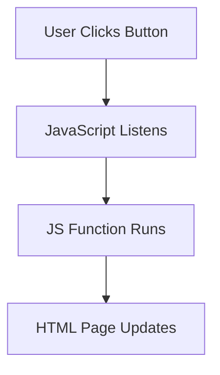

## 📘 What is JavaScript?

**JavaScript** is a high-level **programming language** that adds **interactivity and dynamic behavior** to websites.  
It works in the **browser** and allows you to:

- Respond to user actions (clicks, typing, etc.)
- Update or change HTML/CSS dynamically
- Communicate with servers (e.g. APIs)
- Create animations and complex interfaces
- Build entire web applications

---

## 🚀 What Can JavaScript Do?

- ✅ Handle user interaction
- ✅ Change page content dynamically
- ✅ Validate forms
- ✅ Fetch data from servers (AJAX / Fetch)
- ✅ Control media, games, and animations

---

## 🧠 JavaScript Interaction

**Interaction** means JavaScript reacts when a user does something, like clicking a button or typing in a form.

### 💡 Example: Button Click

```html
<!DOCTYPE html>
<html>
<body>

<h2>Click Me Example</h2>

<button onclick="changeText()">Click Me</button>
<p id="output">Waiting for interaction...</p>

<script>
function changeText() {
  document.getElementById("output").innerText = "Hello, you clicked the button!";
}
</script>

</body>
</html>
````

> When the user clicks the button, the text in the paragraph updates.

---

### 🔁 Common User Interactions

|User Action|JavaScript Event|Use Case|
|---|---|---|
|Click|`onclick`|Buttons, links, toggles|
|Keyboard Press|`onkeydown`|Forms, games|
|Mouse Move|`onmousemove`|Hover effects, tooltips|
|Submit Form|`onsubmit`|Validate form input|
|Page Loaded|`onload`|Run setup code on load|

---

## 🔤 JavaScript Syntax Basics

```javascript
// Variable declaration
let name = "Alice";

// Function
function greet() {
  alert("Hello, " + name);
}
```

---

## 🛠️ Where Does JavaScript Run?

- 🌐 In browsers (Chrome, Firefox, etc.)
    
- ⚙️ On servers using **Node.js**
    

---

## 🔄 JavaScript in the Browser (Visual)



---

## 📚 Related Concepts

- **DOM** – Document Object Model (JS uses it to control HTML)
    
- **Event Listeners** – Functions that wait for user actions
    
- **APIs** – Interfaces to connect JS with external data
    

---

## 🏷 Tags
#Programming_Languages #Learn_to_Code  #JavaScript 

[[Programming Languages]]
